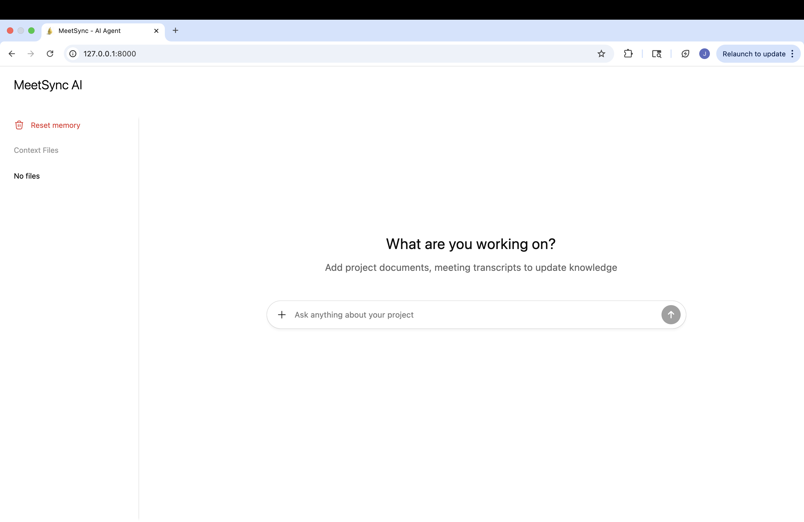
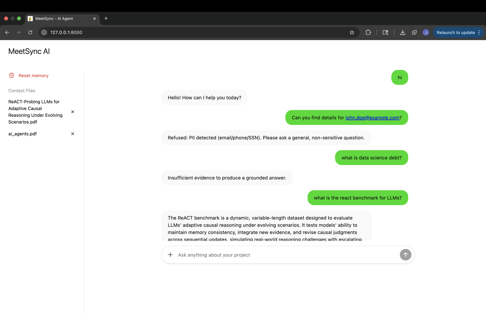

# MeetSync (RAG Pipeline)

**MeetSync** is an AI-powered project assistant with dynamic contextual updates for engineering & product teams

## Core Idea

**Problem:**
Teams often lose track of context and decisions scattered across meeting transcripts, Slack threads, and docs.  
Knowledge becomes siloed, fragmented, and stale, making it hard to find what was decided, when, and why.

**Solution:** 
MeetSync - an AI-powered progress aware assistant:
- Ingests PDFs, `.txt`, and `.md` files as knowledge sources.
- Extracts and chunks text intelligently.
- Embeds content with the **Mistral API**.
- Enables semantic + lexical retrieval through a **custom lightweight vector database**.
- Generates grounded answers with citations via LLM (Mistral-small).
- Includes a simple **web UI** for uploading files, managing memory, and chatting with the system.

## Contents
1. [Core Idea](#core-idea)
2. [Objective](#objective)
3. [Architecture](#architecture)
4. [Features](#features)
5. [Project Structure](#project-structure)
3. [Setup Instructions](#setup-instructions)
6. [Using the App](#using-the-app)
7. [Security and Reliability](#security-and-reliability)
8. [Key Design Decisions](#key-design-decisions)
9. [Example Query FLow](#example-query-flow)
10. [Bonus Features](#bonus-features)
11. [Author](#author)
12. [Summary](#summary)

## Objective

Enable project teams to interact with a dynamically updated, centralized knowledge base that integrates meeting transcripts, project documents, and chat-based UI to instantly retrieve the latest insights and decisions.




## Architecture

| Layer                    | Components                                                                                  | Description                                                                                                                                           |
| ------------------------ | ------------------------------------------------------------------------------------------- | ----------------------------------------------------------------------------------------------------------------------------------------------------- |
| **Frontend (UI)**        | `index.html`, `js/api.js`, `js/main.js`, `css/`                                             | Static web app served by FastAPI. Lets users upload files, query the system, and manage the knowledge base. Uses Fetch API to call backend endpoints. |
| **FastAPI Backend**      | `app/main.py`, `routes/ingest.py`, `routes/query.py`, `routes/files.py`, `routes/delete.py` | RESTful API handling ingestion, querying, and file management. Handles CORS, static serving, and JSON responses.                                      |
| **Ingestion Layer**      | `text_extraction.py`, `delete_ops.py`                                                       | Extracts and cleans text from `.pdf`, `.txt`, `.md`. Creates per-file JSON corpus and metadata. Supports deletion/reset.                              |
| **Indexing Layer**       | `embeddings.py`, `vector_db.py`                                                             | Converts chunks to embeddings via Mistral API. Stores embeddings locally (`.npy`, `.json`). Performs semantic search with cosine similarity.          |
| **Generation Layer**     | `mistral_chat.py`                                                                           | Uses Mistral chat model to generate answers over retrieved chunks. Implements grounding, citation inclusion, and structured response templates.       |
| **Utilities**            | `mistral_client.py`                                                                         | Unified API client with exponential backoff (handles 429s and 5xx retries). Used for both embeddings and chat completions.                            |
| **Data Storage**         | `data/corpus/texts/`, `data/index/`                                                         | Local storage of ingested documents, embeddings, and metadata. No external vector DB.                                                                 |
| **Config & Environment** | `.env`, `config.py`                                                                         | Centralized configuration for API keys, models, and runtime settings. Loaded securely via `dotenv`.                                                   |
| **Launcher**             | `launch.py`                                                                                 | Runs FastAPI app with Uvicorn server, configurable host/port.                                                                                         |

---

## Features

| Capability | Description |
|-------------|-------------|
| **Multi-format ingestion** | Upload and parse `.pdf`, `.txt`, and `.md` files. |
| **Text cleaning & chunking** | Extracted text is normalized and split into uniform chunks. |
| **Local vector database** | Custom NumPy-based `SimpleVectorDB` for similarity search (no external DB). |
| **Semantic + lexical retrieval** | Combines embedding-based and keyword relevance. |
| **Dynamic knowledge base** | Ingest new meeting notes or delete/reset old data on demand. |
| **Citations** | Each answer includes chunk references for transparency. |
| **Rate-limit handling** | Built-in exponential backoff for Mistral API calls (handles 429s). |
| **UI management** | Upload, list, delete, and query knowledge base from browser. |

---

## Project Structure

```
rag-meetsync/
│
├── app/
│ ├── main.py # FastAPI app entrypoint
│ ├── config.py # Loads .env & runtime config
│ ├── models.py # Pydantic response models
│ │
│ ├── core/
│ │ ├── ingestion/
│ │ │ ├── text_extraction.py
│ │ │ ├── delete_ops.py
│ │ ├── indexing/
│ │ │ ├── vector_db.py
│ │ │ ├── embeddings.py
│ │ ├── generation/
│ │ │ └── mistral_chat.py
│ │ └── utils/
│ │ └── mistral_client.py # retry + backoff logic
│ │
│ ├── routes/
│ │ ├── ingest.py
│ │ ├── query.py
│ │ ├── files.py
│ │ └── delete.py
│ │
│ └── ui/ # Frontend (served statically)
│ ├── index.html
│ ├── js/
│ │ ├── api.js
│ │ └── main.js
│ └── css/
│
├── data/
│ ├── corpus/texts/ # Stored JSON per ingested file
│ └── index/ # Embeddings + metadata
│
├── launch.py # uvicorn startup script
├── .env # API keys & config
└── README.md
```

---

## Setup Instructions

### Clone and Install
```bash
git clone https://github.com/dabasjayant/rag-meetsync.git
cd rag-meetsync
pip install -r requirements.txt
```

### Environment Setup
Create a `.env` file at project root:
```
MISTRAL_API_KEY=your_api_key_here
MISTRAL_EMBED_MODEL=mistral-embed
MISTRAL_CHAT_MODEL=mistral-small
HOST=127.0.0.1
PORT=8000
DATA_DIR=data
```

### Run the App
```
python launch.py
```

App will start at: http://127.0.0.1:8000


## Using the App

### Upload Files
- Click "Upload & Ingest".
- Supports .pdf, .txt, and .md.
- Extracted text → chunked → embedded → indexed.

### Manage Files
- View all files in the knowledge base.
- Delete individual files.
- Reset Memory to clear all data (/delete/all).

### Ask Questions
- Type your query in the chat box.
- The system:
  1. Detects query intent.
  2. Retrieves top-k relevant chunks via SimpleVectorDB.
  3. Generates a grounded answer with citations via Mistral.
- Results include answer text and source references.

## Security and Reliability

| Concern           | Mitigation                                 |
| ----------------- | ------------------------------------------ |
| API key exposure  | Stored in `.env`, never sent to client     |
| HTML/JS injection | Input sanitized before request             |
| Rate limits       | Automatic exponential backoff retry        |
| Fault tolerance   | Graceful handling of missing/invalid files |
| Privacy           | Local-only storage (no cloud vector DBs)   |

## Key Design Decisions

| Design Choice              | Rationale                                                      |
| -------------------------- | -------------------------------------------------------------- |
| **FastAPI**                | Simple, async, modern web framework                            |
| **No external vector DB**  | Full transparency; NumPy-based storage                         |
| **Retry/backoff logic**    | Handles Mistral API limits gracefully                          |
| **Separation of concerns** | Core logic (ingestion, indexing, generation) decoupled from UI |
| **Static frontend**        | Zero dependency deployment with built-in serving               |

## Example Query FLow

### User Input:
> "What decisions were made in the last project kickoff meeting?"

### RAG:
- Sanitize input → intent = informational.
- Retrieve top-k relevant chunks from SimpleVectorDB.
- Re-rank and check similarity threshold.
- Construct RAG prompt → send to Mistral LLM.
- Generate answer with citations.

### Response:
The team decided to adopt a modular architecture and migrate to the new API design.

Sources:
- project-kickoff-meeting-8f2a12e3a1:chunk_05
- project-kickoff-meeting-8f2a12e3a1:chunk_06

## Bonus Features

- Citations with similarity thresholds
- "Insufficient evidence" fallback
- Configurable models via `.env`
- Dynamic reindexing after file deletion
- Rate-limit handling for embeddings & completions
- Secure file and query handling (sanitized input)
- One-click "Reset Knowledge Base"

## Author

**Jayant Dabas**<br>
Machine Learning Engineer | Data Scientist<br>
GitHub: [@JayantDabas](https://github.com/dabasjayant)

## Summary

MeetSync demonstrates a full-stack, production-ready mini RAG pipeline:
- Built from scratch (no external vector DBs or RAG libraries)
- Modular architecture
- API-driven backend with clean retry handling
- Browser-based, minimal UI for realistic user interaction